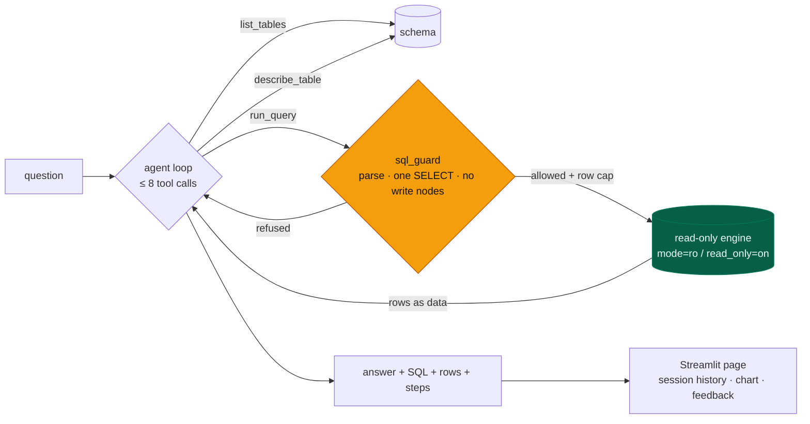
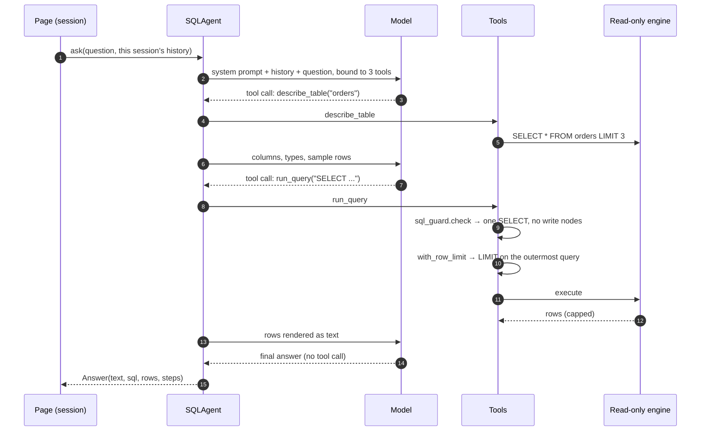

# SQL Agent

[](https://github.com/daniellopez882/The-Intelligent-Semantic-Layer-for-Modern-Data-Teams/actions/workflows/ci.yml)


Ask a database questions in plain language. A small tool-calling agent
inspects the schema, writes **one read-only SELECT**, runs it on a connection
that **cannot write**, and answers from the rows it got back. A Streamlit page
shows the answer, the rows, a chart and every step the agent took.

## At a glance

| | |
|---|---|
| **Does** | Schema discovery → a guarded, row-capped SELECT → a plain-language answer; per-session history; a chart from the fetched rows; thumbs-up/down feedback logged with the SQL that produced the answer |
| **Cannot** | Write. SQLite is opened `mode=ro`; Postgres sessions are `default_transaction_read_only=on`; a backend without a read-only mode is refused. CI runs a `DELETE` through the agent's engine and requires the database to refuse it |
| **Model** | Any OpenAI-compatible endpoint (`LLM_BASE_URL`, `LLM_MODEL`); DeepSeek by default because that is what the code was written against |
| **Tests** | 94 — none reach a network or need a key; the page is driven headlessly with Streamlit's `AppTest` |
| **CI** | lint · tests on 3.11/3.12 · the write-refusal check · bandit (fails the job) · gitleaks · container built, non-root, health-checked |
| **Not measured** | Answer accuracy. Every number on the page is labelled as the result of a query the agent ran; nothing here scores whether the query was the right one |

## Architecture



### One question



## Quick start

```bash
python -m venv .venv && . .venv/bin/activate     # Windows: .venv\Scripts\activate
pip install -r requirements.txt
cp .env.example .env                              # set LLM_API_KEY
streamlit run app.py
```

With the default `DATABASE_URL=sqlite:///ecommerce.db` a deterministic sample
database (40 customers, 12 products, 250 orders, seed 42) is created on first
start. Point `DATABASE_URL` at your own SQLite file or Postgres database; it
is opened read-only either way.

### Container

```bash
docker build -t sql-agent .
docker run --rm -p 8501:8501 --env-file .env -v sqlagent-data:/app/data sql-agent
```

## Configuration

| Variable | Default | Notes |
|---|---|---|
| `LLM_API_KEY` | — | Required to ask anything. `DEEPSEEK_API_KEY` is accepted as an alias |
| `LLM_BASE_URL` · `LLM_MODEL` | `https://api.deepseek.com/v1` · `deepseek-chat` | Any OpenAI-compatible endpoint |
| `DATABASE_URL` | `sqlite:///ecommerce.db` | Opened read-only. Postgres via `postgresql://…` |
| `MAX_ROWS` | `100` | Applied on the outermost query; the page says when a result was capped |
| `HISTORY_TURNS` | `3` | Prior turns shown to the model, from this session only |
| `FEEDBACK_PATH` | `evaluations.csv` | Thumbs-up/down log with question, SQL, answer. Empty disables it |

## What changed, and why

Every defect below was reproduced on the original code before it was fixed.

| # | Defect | Effect |
|--:|---|---|
| 1 | The connection was read-write and the only guard was a prompt sentence | `DELETE FROM customers` through the agent's connection left zero rows |
| 2 | `SafeSQLExecutor` was imported and never used | The advertised safety layer did not run |
| 3 | Its substring check refused any column containing a keyword | `SELECT created_at FROM t` was "unsafe" |
| 4 | Its limit logic looked for the word LIMIT anywhere | A LIMIT in a subquery left the outer query unbounded |
| 5 | A question-level keyword filter | Refused "which products were **updated**?"; admitted "remove every row from orders" |
| 6 | The agent was a server-wide singleton holding `self.history` | Every user of the server shared one conversation |
| 7 | Feedback buttons rendered inside `if run_query:` | A click reruns the script without that block; they could never log anything |
| 8 | Feedback logged the SQL as `"N/A"` | The one thing worth recording was not |
| 9 | Sidebar: "DeepSeek-V3: Online", "Security: Row-Level Active", "Schema Cache: Active" | Static text; nothing checked the model, no row-level security existed, no cache existed |
| 10 | The page re-ran the model's SQL through a second, unguarded, read-write engine | To draw the chart |
| 11 | `test_agent.py` wrapped everything in `try/except: print` | Passed with no API key at all |
| 12 | `auto_visualize` renamed the caller's DataFrame columns in place | The data tab and the chart disagreed on column names |

<details>
<summary>Also</summary>

No version constraints; five packages listed that nothing imported; the model, base URL and `top_p` hardcoded (`model_kwargs={"top_p": …}` is refused by recent `langchain-openai`); the legacy `create_sql_agent` / AgentExecutor path with no step bound; unseeded sample data (a different demo on every run); emoji printed to stdout by the setup script; a bare `except:`; user questions written to the feedback CSV unescaped (spreadsheet formula injection); a README asserting that "90% of business stakeholders can't query their own data".

</details>

## Design notes

| Record | Decision |
|---|---|
| [ADR 0001](docs/adr/0001-read-only-is-a-property-of-the-connection.md) | Read-only is a property of the connection; the guard is a parser |
| [ADR 0002](docs/adr/0002-the-agent-owns-its-tools.md) | The agent owns its tools; the loop is small and bounded |
| [ADR 0003](docs/adr/0003-session-state-not-singleton-state.md) | Conversation and results live in session state; status is measured |
| [Threat model](docs/threat-model.md) | Assets, six threats, what is not addressed |

## Layout

```
app.py           the Streamlit page
agent.py         the tool-calling loop; Answer / Step
tools.py         list_tables, describe_table, run_query → QueryResult
sql_guard.py     parse; one SELECT; no write nodes; outermost LIMIT
db.py            read-only engines for SQLite and Postgres
llm.py           the one place a model is built; the test seam
config.py        settings
setup_db.py      deterministic sample database
visualizer.py    chart picker (works on a copy)
tests/           94 tests
docs/            ADRs, threat model
```

## Limits

- No authentication on the page: whoever reaches the port can ask the
  database whatever the read-only user can read. Put it behind a proxy and
  grant that user the minimum.
- One provider style (OpenAI-compatible). No rate limit or per-user quota.
- Nothing here has been run against a model or a real database; the tests
  use a scripted model and the sample SQLite file.

## Licence

MIT — see [LICENSE](LICENSE).
