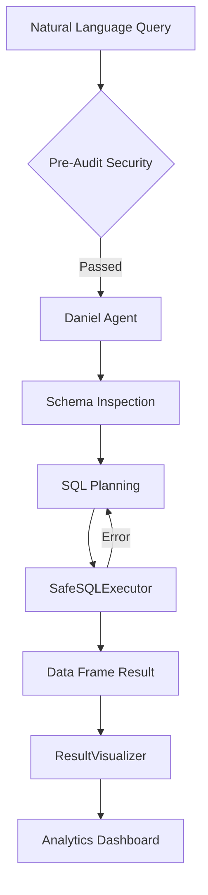

<div align="center">

# 💎 Daniel SQL AI
### The Intelligent Semantic Layer for Modern Data Teams

<br/>

[](https://deepseek.com)
[](https://langchain.com)
[](https://streamlit.io)
[](https://postgresql.org)
[](https://github.com/Daniel-pk)

<br/>

**Daniel SQL AI** is a premium, autonomous Data Analyst designed to bridge the gap between complex databases and executive decision-making. No SQL, no bottlenecks—just raw intelligence delivered through a stunning, glassmorphic interface.

[**Exploration Hub**](#-core-capabilities) • [**Architecture**](#-deep-engine-logic) • [**Deployment**](#-lightning-setup) • [**Roadmap**](#-the-vision)

---

</div>

## 🚀 The Reality of Modern Data

Data is growing, but the ability to *query* it remains a bottleneck. Technical debt and "ticket-queues" for simple analytics are costing enterprises thousands of hours.

*   **The Problem**: 90% of business stakeholders can't query their own data.
*   **The Wait**: Data analysts are overwhelmed with repetitive CRUD-style requests.
*   **The Risk**: Raw SQL execution without guardrails is a liability.

**Daniel SQL AI solves this by introducing an Agentic Reasoning Layer.**

---

## ✨ Core Capabilities

### 🧠 Autonomous Semantic Reasoning
Powered by **DeepSeek-V3**, our engine doesn't just "generate" SQL—it *understands* your schema.
*   **Schema Pruning**: Dynamically inspects tables and columns before planning.
*   **Multi-Step ReAct Loop**: If a query fails, the agent self-corrects and iterates until the data is found.
*   **Business Translation**: Every result comes with a "Neural Logic" summary explaining the 'Why' behind the numbers.

### 📈 Predictive Visualization Engine
Stop staring at tables. Daniel SQL AI detects the shape of your data and selects the optimal visual representation instantly.
*   **Timeline Analysis**: Automatic spline-charts for time-series data.
*   **Categorical Depth**: Bar and Donut charts for departmental breakdowns.
*   **Interactive Overlays**: Plotly-powered dark mode charts designed for executive presentations.

### 🛡️ Layered Security Protocol
Enterprise safety is baked into the core.
*   **Layer 1 (Pre-Audit)**: Prevents malicious input before it ever reaches the LLM.
*   **Layer 2 (Safe Execution)**: Read-only enforcement with `SELECT`-only privileges and automatic `LIMIT 100` injection.
*   **Complexity Scoring**: Real-time analysis of query performance risks (JOIN/Subquery counting).

---

## 🛠️ Deep Engine Logic

### The "Nexus" Architecture
Daniel SQL AI operates on a state-of-the-art **ReAct (Reason + Action) framework**:



### Technical Blueprint
| Module | Technology | Function |
| :--- | :--- | :--- |
| **LLM Core** | `DeepSeek-V3` | High-fidelity SQL reasoning & Code generation |
| **Orchestration** | `LangChain` | Autonomous agentic workflow management |
| **Frontend** | `Streamlit` | Custom-themed Glassmorphism UI |
| **Visuals** | `Plotly Express` | Executive-grade interactive charting |
| **Persistence** | `SQLAlchemy` | Universal DB adapter (PostgreSQL / SQLite) |

---

## 🌩️ Lightning Setup

### 1. Initialize Environment
```bash
git clone https://github.com/Daniel-pk/Daniel-SQL-AI.git
cd Daniel-SQL-AI
python -m venv venv
source venv/bin/activate  # Or venv\Scripts\Activate
pip install -r requirements.txt
```

### 2. Configure Credentials
Create a `.env` file with your API key:
```env
DEEPSEEK_API_KEY=your_key_here
# Optional: DATABASE_TYPE=postgresql
```

### 3. Launch the Intelligence Hub
```bash
streamlit run app.py
```

---

## 🗺️ The Vision

- [x] **v1.0**: Core ReAct Engine + Visualizer + Security Layer.
- [ ] **v1.5**: Multi-Agent Orchestration (Specialized Charting Agents).
- [ ] **v2.0**: Vector-Search for Large-Scale Schema Pruning (1000+ Tables).
- [ ] **v2.5**: One-Click PDF Executive Report Generation.

---

## 🤝 Join the Movement

Daniel SQL AI is built for everyone who believes data should be a conversation, not a chore.

*   **Star the Repo** if this changes your workflow.
*   **Open an Issue** for feature requests.
*   **Contribute** to the security or visualization layers.

<br/>

<div align="center">

Built with ❤️ by [Daniel](https://github.com/daniellopez882/)

**Transforming raw data into actionable intelligence.**

</div>
